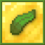
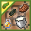
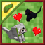
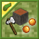
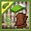

# Daenvil's Vegancraft
A datapack/collection of datapacks which makes a vegan gamestyle possible in a vanilla-like way without missing any game features.

You can either download the full collection in a single datapack or [download the individual datapacks as desired](#features).

## Full datapack download

### 1.19+ version

- Latest release (v1d): [Github](https://github.com/daenvil/vegancraft/releases/download/v1d/vegancraft-DP_v1d.zip)
- Required resourcepack: [Github](https://github.com/daenvil/vegancraft/releases/download/v1d/vegancraft-RP_v1d.zip)

### 1.17-1.18.2 version

- Latest release (v1d-mc1.17-1.18.2): [Github](https://github.com/daenvil/vegancraft/releases/download/v1d-mc1.17-1.18.2/vegancraft-DP_v1d-mc1.17-1.18.2.zip)
- Required resourcepack: [Github](https://github.com/daenvil/vegancraft/releases/download/v1d-mc1.17-1.18.2/vegancraft-RP_v1d.zip)

_Note: The resourcepack will give you a warning if you are not using 1.19, but it will work. Both datapack and resourcepack were tested on the mentioned versions; and also on multiplayer._

### Installation
- Drop the datapack zip file inside the "datapacks" folder of your world folder (*\<your minecraft folder\>/saves/\<your world\>/datapacks/*).
- Drop the resourcepack zip file inside the "resourcepacks" folder of your minecraft folder.

## Features
This datapack aims to make any vanilla feature available without hurting or using any mob. The currently implemented features, also available as individual datapacks, are listed below.

### Plant-based Foods

Vegan alternatives to dairy, eggs, honey, and meat.

More info and individual datapack download: _[Plant-based Foods](https://github.com/daenvil/vegancraft/wiki/Plant%E2%80%90based-Foods)_

### Omnivorous Pets

Tame cats and wolves using any food. You don't need meat anymore to make animal friends!

More info and individual datapack download: _[Omnivorous Pets](https://github.com/daenvil/vegancraft/wiki/Omnivorous-Pets)_

### Acacia Gum

Get gum from stripping acacia trees. A vegan alternative for slime.

More info and individual datapack download: _[Acacia Gum](https://github.com/daenvil/vegancraft/wiki/Acacia-Gum)_

### Ethical Textiles

Plant-based alternatives for string, leather, and beds. Use together with _Acacia Gum_ to have fully vegan leather.

### Resourcepack

Most of these datapacks contain custom textures and item names. The Vegancraft resourcepack is needed in order to view them properly. For simplicity, this resourcepack is the same for all datapacks, and is available on the [Downloads](#full-datapack-download) section or in the PlanetMinecraft page of any single datapack that uses it.

### Customization options

- **These individual datapacks are entirely modular**, meaning that if you don't like one (or more) of them, you can just download all the rest of them without worrying about compatibility issues. The "full" datapack (downloadable at the top of the page) is just an optimized merged version of all of these datapacks.

- As detailed on the individual datapacks, some features, such as custom advancements or XP rewards for crafting vegan items, can be disabled by using the command "**/function dnv.vegancraft:toggle**". You can also use that command to turn them on again. This allows to play in an even more vanilla way, if desired.

## Future Features
Planned datapacks that are still in progress

### Plant Wax

Get wax from some plants, like in real life. A vegan alternative for honeycomb.

### Copper horns

Craft horns using copper and wax.

## Legal terms

You are allowed to:

- Download, use, and edit this datapack[^1] **for personal use**.
- Use this datapack or variations of it in a Minecraft server.
- Create public content that uses this datapack or variations of it (e.g. gameplay videos on online platforms), as long as you **acknowledge me (Daenvil) as the author of this datapack** and provide a link to this Github repository.

You are not allowed to:

- Publish this datapack or variations of it without explicit permission from me.

[^1]: For all legal purposes, "this datapack" refers to all the files (source code, images, and any other) present in this repository.

## Contributing

If you wish to contribute in any way to the development of Vegancraft, you can [contact me](#contact) on any platform, I will gladly welcome feature suggestions or even collaborators.

You can also [create an Issue](https://github.com/daenvil/vegancraft/issues/new/choose) on this repository for bug reports, feature requests, contributions, or any question you may have.

### Translations

If you wish to translate this datapack to your language(s) (or fix any already existing one), just use the "lang" files you can find inside the resorcepack as template, and send your version to me either via a pull request or an issue. I will credit you as translator on here, on the corresponding datapacks' PlanetMinecraft pages, and on the README file of the resourcepack.

## Contact

Daenvil:
- **PlanetMinecraft** profile: [daenvil](https://www.planetminecraft.com/member/daenvil/)
- **Discord**: *Daenvil#9550* (you can find me on the [MC Datapacks server](https://discord.gg/SnJQcfq))

