# Plant-based Foods
A datapack that adds vegan alternatives to dairy, eggs, honey, and meat.

## Downloads

- Latest Release (v1): [PlanetMinecraft](https://www.planetminecraft.com/data-pack/plant-based-foods/) | [Github](https://github.com/daenvil/vegancraft/releases/download/v1a/plant-based_foods_v1.zip)
- Required Resourcepack: [PlanetMinecraft](https://www.planetminecraft.com/data-pack/plant-based-foods/) | [Github](https://github.com/daenvil/vegancraft/releases/download/v1a/vegancraft-RP_v1a.zip)

## Features

### New recipes

These recipes will output a knowledge book, the knowledge book will convert automatically into the desired item once you click on it. ***Not compatible with recipe unlockers***.

*Note: due to the way I coded the recipes, sometimes the output will show the actual vanilla item instead of the knowledge book. If you want the custom item name and texture, just change the position of any ingredient and the output will change to the knowledge book. I decided to do it this way so the recipes show up in the in-game recipe book, instead of having to memorize them.*

- Here is an example, the recipe shows a vanilla honey bottle, and changing the position of one ingredient outputs the knowledge book:

  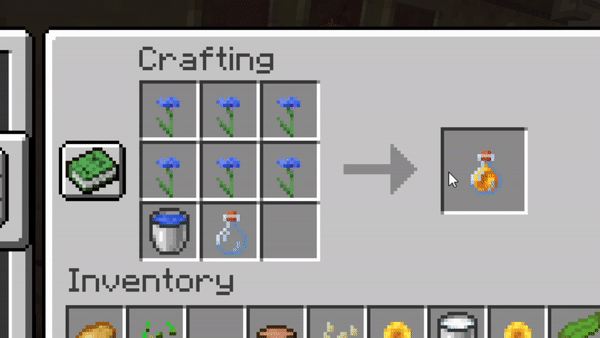

#### Plant-based milk
Crafted with a water bucket, an empty bucket, and 6 wheat seeds, pumpkin seeds, potatoes, or sunflowers. *Behaves as a milk bucket*.

  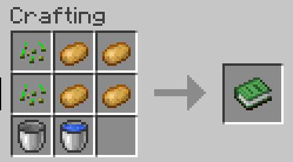

#### Egg baking alternatives
**Pumpkin pies** and **cakes** can be crafted by replacing the egg in the vanilla recipe with wheat or a potato.

  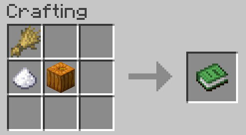
  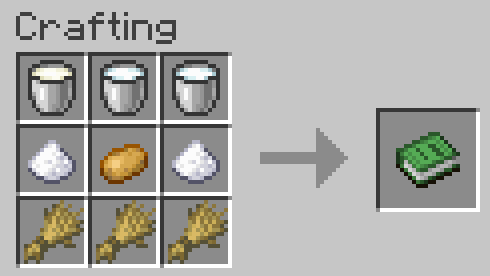

#### Vegan honey
Crafted in two ways:
- A water bucket, an empty bottle, and 6 flowers.
- An empty bottle and 4 apples.

*Behaves as a honey bottle*.

  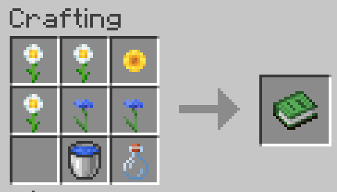
  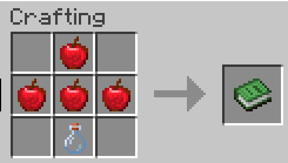

#### Seitan steak
Crafted with a water bucket, 3 wheat, and either mushroom stew or beetroot soup. *Behaves as a steak*.

  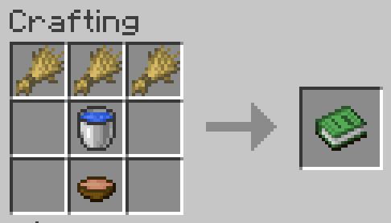

Alternatively, use hay bales instead of wheat to produce seitan more efficiently:

  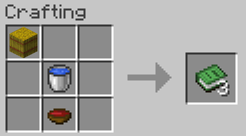

#### Not-fish fillet
Crafted with a (seitan) steak and 3 kelp. *Behaves as raw cod (so you can attract cats with it and tame them)*.

  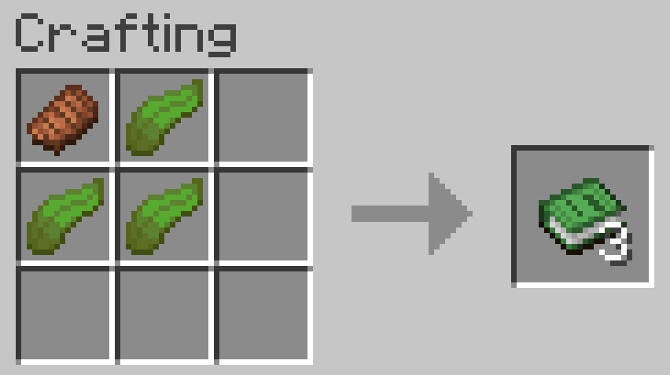

### Custom textures
Each of the new food items has its own texture. Here they are compared to their vanilla counterparts:

  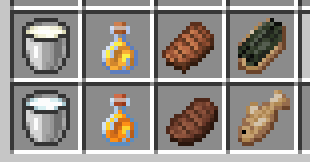

The [Vegancraft Resourcepack](#downloads) is required to see these textures in-game.

### Vegancraft

This is a standalone datapack, but was originally designed as a part of Vegancraft, a collection of datapacks with the goal of making a vegan gamestyle possible in a vanilla-like way without missing any game features.

As part of its integration on Vegancraft, this datapack includes the following additional features:

- A custom advancement tree.
- Vegan ingredients detection: since you can craft cakes with cow milk and not-fish fillets with cow meat, the datapack will try to determine if you are using vegan ingredients or not when crafting these items, labelling them if they are not vegan. Vegan and non-vegan items do not stack.

  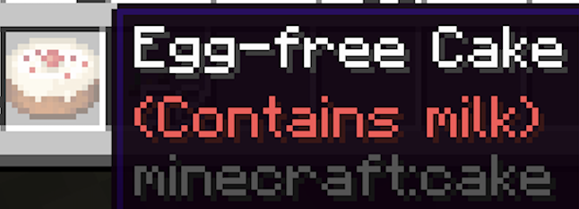
  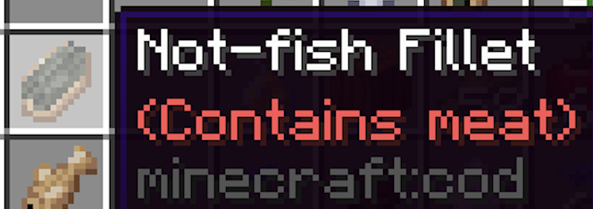

- Cats and wolves tamed with vegan food will have a green collar by default, instead of the usual red (check out my *Omnivorous Pets* datapack (*to be released*)  if you want to tame wolves and cats with more kinds of foods).

If, for any reason, you want to remove these features, you can use the command "**/function dnv.vegancraft:switch**" to disable them. You can also use that command to turn them on again.

## Reasoning for the recipes

- All of the plant milk recipes are based on real plant-based milks (the sunflower representing sunflower seeds).
- The egg replacements -wheat and potato- represent wheat and potato starch, respectively, both used in real-life egg-free baking.
- Flower honey represents a kind of vegan honey that can be made by boiling flowers in water. Apple honey represents apple syrup, and there are also some recipes for vegan honey made from apple syrup or juice.
- Seitan is made by soaking wheat flour in water and filtering it. The stew/soup represents a marinade to give the seitan steak flavour.
- Not-fish fillet is based on real recipes for "vegan fish", although in real life it is more common to use tofu for this.

## Known issues and solutions
- As mentioned before, some recipes in the in-game recipe book will show the vanilla item instead of the custom one. This is on purpose since it is the only way (to my knowledge) of making them appear on the recipe book. The recipes of the custom items are shapeless, so you can just change the position of any ingredient and the output will change to the knowledge book, which will convert to the custom item. You can also use this to your advantage if you already have vanilla items in your inventory and you want to stack on them instead of having custom items on a separate stack. However, this is not consistent and sometimes the knowledge book is the only possible output.
- Vegan ingredients detection can fail if you drop or pick up vegan items while having the crafting table UI open. This will not be fixed as it is a very rare occurrence and easily avoidable, and the solution would be very difficult to code with datapack functionalities, if not impossible.

## Notes for developers
If you are creating a datapack that adds custom food and you want your custom food to be recognized by this datapack, just do the following:
- If it is a vegan food retexturing a non-vegan food item, just include the tag "dnv.Vegan:1b" in the NBT tags of the item.
- If it is a non-vegan food retexturing a vegan food item, just include the tag "dnv.Vegan:0b" in the NBT tags of the item.
